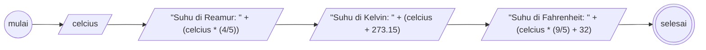

### Flowchart

```mermaid

flowchart LR
    Start((mulai))
    Celcius[/celcius/]
    HasilReamur[/"#quot;Suhu di Reamur: #quot; + (celcius * (4/5))"/]
    HasilKelvin[/"#quot;Suhu di Kelvin: #quot; + (celcius + 273.15)"/]
    HasilFahrenheit[/"#quot;Suhu di Fahrenheit: #quot; + (celcius * (9/5) + 32)"/]
    End(((selesai)))

    Start --> Celcius
    Celcius --> HasilReamur
    HasilReamur --> HasilKelvin
    HasilKelvin --> HasilFahrenheit
    HasilFahrenheit --> End

```
